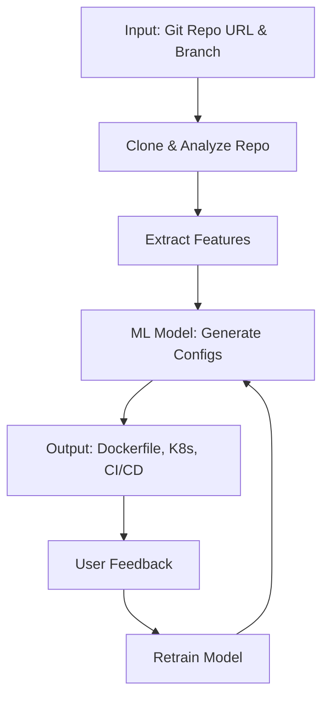

# CloudOpsGenAI
# 🤖 AI-Powered DevOps Automation Tool

[](https://opensource.org/licenses/MIT)
[](https://www.python.org/downloads/)
[](https://www.docker.com/)
[](https://kubernetes.io/)

An intelligent automation tool that analyzes Git repositories and automatically generates production-ready Dockerfiles, Kubernetes manifests, and CI/CD pipelines using machine learning and natural language processing.

## 🌟 Features

- **🔍 Intelligent Repository Analysis**: Automatically detects tech stack, dependencies, and project structure
- **🐳 Docker Configuration**: Generates optimized multi-stage Dockerfiles with best practices
- **☸️ Kubernetes Manifests**: Creates deployment, service, and ingress configurations
- **🚀 CI/CD Pipeline Generation**: Supports GitHub Actions, GitLab CI, and Jenkins
- **🧠 Machine Learning Powered**: Learns from examples and improves over time
- **📊 Multi-Language Support**: Python, Node.js, Java, Go, and more
- **🔒 Security Best Practices**: Implements security scanning and compliance checks
- **📈 Continuous Learning**: User feedback loop for model improvement

## 🏗️ Architecture



## 🚀 Quick Start

### Prerequisites

- Python 3.8+
- Docker
- Kubernetes cluster (optional, for testing generated manifests)
- Git

### Installation

1. **Clone the repository**
   ```bash
   git clone https://github.com/ashithss/CloudOpsGenAI.git
   cd CloudOpsGenAI
   ```

2. **Install dependencies**
   ```bash
   pip install -r requirements.txt
   ```

3. **Set up environment variables**
   ```bash
   cp .env.example .env
   # Edit .env with your API keys and configuration
   ```

4. **Run the application**
   ```bash
   python app.py
   ```

### Docker Setup

```bash
# Build the image
docker build -t ai-devops-tool .

# Run the container
docker run -p 8000:8000 -v $(pwd):/app ai-devops-tool
```

## 📖 Usage

### Command Line Interface

```bash
# Analyze a repository and generate configurations
python analyze.py --repo https://github.com/user/repo --branch main

# Generate only Dockerfile
python analyze.py --repo https://github.com/user/repo --output dockerfile

# Generate Kubernetes manifests
python analyze.py --repo https://github.com/user/repo --output kubernetes

# Generate CI/CD pipeline
python analyze.py --repo https://github.com/user/repo --output cicd --platform github
```

### API Usage

```python
import requests

# Analyze repository
response = requests.post('http://localhost:8000/analyze', json={
    'repo_url': 'https://github.com/user/repo',
    'branch': 'main',
    'output_types': ['dockerfile', 'kubernetes', 'cicd']
})

configurations = response.json()
```

### Web Interface

Access the web interface at `http://localhost:8000` after starting the application.

## 🔧 Configuration

### Environment Variables

| Variable | Description | Default |
|----------|-------------|---------|
| `OPENAI_API_KEY` | OpenAI API key for LLM | - |
| `HUGGINGFACE_TOKEN` | HuggingFace token | - |
| `MODEL_PATH` | Path to trained model | `models/` |
| `OUTPUT_DIR` | Output directory for generated files | `output/` |
| `LOG_LEVEL` | Logging level | `INFO` |

### Model Configuration

```yaml
# config/model_config.yaml
model:
  type: "api" # or "fine-tuned"
  provider: "openai" # or "huggingface"
  model_name: "gpt-4"
  temperature: 0.1
  max_tokens: 2000

analysis:
  supported_languages:
    - python
    - javascript
    - java
    - go
    - rust
  
  features:
    - dependencies
    - frameworks
    - database_connections
    - environment_variables
    - build_tools
```

## 🏭 Project Structure

```
CloudOpsGenAI/
├── src/
│   ├── analyzers/           # Repository analysis modules
│   │   ├── language_detector.py
│   │   ├── dependency_parser.py
│   │   └── structure_analyzer.py
│   ├── generators/          # Configuration generators
│   │   ├── dockerfile_generator.py
│   │   ├── kubernetes_generator.py
│   │   └── cicd_generator.py
│   ├── models/              # ML model components
│   │   ├── feature_extractor.py
│   │   ├── model_trainer.py
│   │   └── inference_engine.py
│   └── api/                 # API endpoints
│       ├── routes.py
│       └── validators.py
├── data/                    # Training data and examples
├── models/                  # Trained models
├── templates/               # Configuration templates
├── tests/                   # Test suite
├── docker/                  # Docker configurations
├── k8s/                     # Kubernetes manifests
└── docs/                    # Documentation
```

## 🎯 Development Phases

### Phase 1: Repository Analysis ✅
- [x] Git repository cloning and access
- [x] Directory structure scanning
- [x] Package manager parsing
- [x] Framework and library detection
- [x] Database and service identification

### Phase 2: Intelligence Layer 🚧
- [x] LLM integration with structured prompts
- [x] Tech stack summary generation
- [ ] Advanced containerization requirement detection
- [ ] Resource requirement analysis
- [ ] Security and compliance assessment

### Phase 3: Artifact Generation 🚧
- [x] Basic Dockerfile generation
- [x] Kubernetes manifest creation
- [ ] Advanced CI/CD pipeline configurations
- [ ] Monitoring and logging setup
- [ ] Documentation generation

### Phase 4: Validation & Optimization 📋
- [ ] Configuration validation
- [ ] Sandbox environment testing
- [ ] Performance optimization recommendations
- [ ] Automated deployment scripts


## 🤝 Contributing

We welcome contributions! Please see our [Contributing Guide](CONTRIBUTING.md) for details.

1. Fork the repository
2. Create a feature branch (`git checkout -b feature/amazing-feature`)
3. Make your changes
4. Add tests for your changes
5. Commit your changes (`git commit -m 'Add amazing feature'`)
6. Push to the branch (`git push origin feature/amazing-feature`)
7. Open a Pull Request

## 📊 Training Data Strategy

### Data Collection
- Repository pairs with existing configurations
- Multiple tech stacks (Node.js, Python, Java, Go, etc.)
- Successful CI/CD pipeline examples
- Security best practices and optimizations

### Model Approaches

#### Option A: API-First (Recommended for beginners)
- Uses existing LLM APIs with crafted prompts
- Robust prompt engineering pipeline
- Focus on preprocessing and validation
- Faster to market, lower complexity

#### Option B: Fine-tuning
- Base code model (CodeLlama/Deepseek-Coder)
- Custom training dataset
- DevOps-specific task optimization

## 🔮 Roadmap

- **Q1 2024**: Basic repository analysis and Dockerfile generation
- **Q2 2024**: Kubernetes manifest generation and validation
- **Q3 2024**: CI/CD pipeline automation and testing
- **Q4 2024**: Advanced ML model training and deployment
- **Q1 2025**: Multi-cloud support and enterprise features

## 📚 Documentation

- [API Documentation](docs/api.md)
- [Configuration Guide](docs/configuration.md)
- [Model Training Guide](docs/training.md)
- [Deployment Guide](docs/deployment.md)
- [Troubleshooting](docs/troubleshooting.md)

## 🛠️ Tech Stack

- **Backend**: Python, FastAPI
- **ML/AI**: HuggingFace Transformers, OpenAI API
- **Containerization**: Docker, Kubernetes  
- **CI/CD**: GitHub Actions, GitLab CI, Jenkins
- **Database**: PostgreSQL, Redis
- **Frontend**: React, TypeScript (optional web UI)

## 📄 License

This project is licensed under the MIT License - see the [LICENSE](LICENSE) file for details.

## 👥 Authors

- **Ashith** - *Initial work* - [YourGitHub](https://github.com/ashithss)

## 🙏 Acknowledgments

- OpenAI for GPT models
- HuggingFace for transformer models
- The open-source DevOps community
- Contributors and beta testers

## 📞 Support

- 📧 Email: ashithss33@gmail.com
- 🐛 Issues: [GitHub Issues](https://github.com/ashithss/CloudOpsGenAI/issues)

---

⭐ **Star this repository if you find it helpful!**

[](https://github.com/ashithss/CloudOpsGenAI/stargazers/)